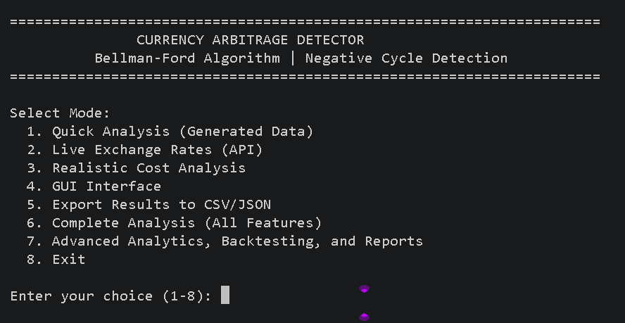
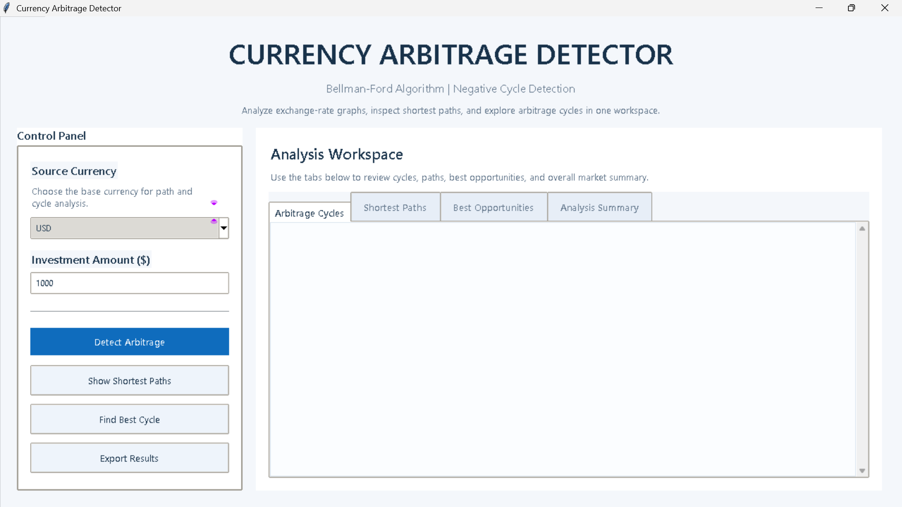

# Currency Arbitrage Detector

A Python research system that models foreign exchange markets as a weighted directed graph and applies the **Bellman-Ford algorithm** to detect arbitrage opportunities through negative-cycle detection.

Built as a graph-theory and algorithms project, it grew into a full research pipeline covering live rate ingestion, transaction cost modelling, backtesting, real-time monitoring, a Tkinter GUI, and a FastAPI dashboard.

---

## How It Works

Each exchange rate is converted to a log-weight edge:

```
w(u, v) = -log(rate(u, v))
```

A profitable currency cycle — where the product of rates exceeds 1 — produces a **negative total weight**. Bellman-Ford's V-th relaxation pass exposes it in **O(V × E)** time, transforming an arbitrage detection problem into a classical graph search.

---

## Key Features

- Bellman-Ford shortest-path computation and negative-cycle detection
- Synthetic exchange-rate generation with optional injected arbitrage
- Live rate fetching from `exchangerate-api` and `frankfurter`
- Transaction cost modelling — spread, commission, and slippage (tiered by trade size)
- Opportunity ranking with composite risk scoring
- Portfolio simulation across top-ranked cycles
- Historical backtesting over saved CSV rate snapshots
- Real-time monitoring with configurable profit-alert thresholds
- HTML and PDF report generation with Matplotlib charts
- Interactive Tkinter GUI — graph canvas, cycle table, animated profit bars
- FastAPI dashboard with JSON endpoints and live HTML view
- SQLite persistence for monitoring runs and opportunities

---

## Architecture

```
main.py  ──imports──▶  currency_arbitrage/   (canonical package)
                       ├── core/             BellmanFord · CurrencyGraph · ArbitrageDetector
                       ├── analytics/        costs · ranking · backtesting · export · reports
                       ├── providers/        synthetic and live rate providers
                       ├── api/              FastAPI application
                       ├── persistence/      SQLite layer
                       └── ui/               Tkinter GUI

web_api.py  ──wraps──▶  advanced_features/  (extended monitoring and analytics)
```

---

## Tech Stack

| Layer | Libraries |
|-------|-----------|
| Algorithm | Pure Python (`math`, standard library) |
| Graph | `networkx`, `matplotlib` |
| Data | `pandas`, `numpy`, `openpyxl` |
| GUI | `tkinter` (standard library) |
| Live rates | `requests` |
| Web API | `fastapi`, `uvicorn` |
| Tests | `pytest` (dev dependency) |

---

## Project Structure

```
currency_arbitrage_project/
├── currency_arbitrage/         # Canonical package
│   ├── core/                   # Algorithm implementations
│   ├── analytics/              # Costs, ranking, backtesting, export, reports
│   ├── providers/              # Rate data sources
│   ├── api/                    # FastAPI app
│   ├── persistence/            # SQLite history
│   └── ui/                     # Tkinter GUI
├── advanced_features/          # Extended analytics and monitoring
├── data/
│   ├── inputs/                 # exchange_rates.csv  (25-currency sample)
│   └── historical_snapshots/   # Backtesting CSV fixtures
├── output/reports/             # csv/  json/  excel/  text/
├── tests/
├── main.py
├── web_api.py
├── requirements.txt
└── LICENSE
```

---

## Installation

```bash
git clone <repository-url>
cd currency_arbitrage_project

# Create and activate virtual environment
python -m venv .venv
.venv\Scripts\Activate.ps1      # Windows PowerShell
source .venv/bin/activate        # Linux / macOS

pip install -r requirements.txt
```

---

## Screenshots

**CLI — interactive menu**



**GUI — analysis workspace**



---

**Interactive CLI**

```bash
python main.py
```

Menu options:

```
1. Quick Analysis (Generated Data)
2. Live Exchange Rates (API)
3. Realistic Cost Analysis
4. GUI Interface
5. Export Results to CSV/JSON
6. Complete Analysis (All Features)
7. Advanced Analytics, Backtesting, and Reports
8. Exit
```

**FastAPI dashboard**

```bash
uvicorn web_api:app --reload
```

Open `http://127.0.0.1:8000/dashboard`

---

## API Endpoints

| Method | Endpoint | Description |
|--------|----------|-------------|
| GET | `/health` | Service health check |
| GET | `/providers/compare` | Rate comparison across providers |
| GET | `/backtest` | Backtesting over historical snapshots |
| GET | `/monitor/run` | Single monitoring iteration |
| GET | `/dashboard` | HTML monitoring dashboard |

---

## Testing

```bash
python -m pytest tests/ -v
```

**20 / 20 tests pass** on Python 3.14.3.

Covers: Bellman-Ford correctness, arbitrage detection, data generation, advanced analytics, persistence, and monitoring.

---

## Sample Output

```text
# Synthetic example — values vary per run
Running Quick Analysis...
   [OK] Generated 25 currencies
   [OK] Graph built: CurrencyGraph(25 currencies, 600 edges)
   [WARNING] Negative cycle detected! 3 nodes affected

TOP 5 PROFITABLE CYCLES:
  1. USD -> EUR -> GBP -> USD
     Gross Return: 1.014300  |  Profit: 1.4300%
     Example: $1000 -> $1014.30
```

*The generator applies ±5% random variation to base rates, so figures differ on every run.*

---

## Limitations

This is a **research and educational tool**, not a production trading system.

- Detected cycles are theoretical — live arbitrage windows close in milliseconds due to high-frequency trading, fees, and latency.
- Live rate providers are free-tier APIs with rate limits; data may not reflect real market conditions.
- Historical snapshots are synthetically generated, not sourced from real market feeds.

---

## License

MIT © 2026 Tedros Weldegebriel — see [LICENSE](LICENSE).
